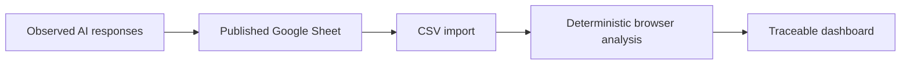

# AnswerLens · AI Product Factory

AnswerLens is a time-boxed AI visibility experiment for B2B SaaS marketing teams. It turns observed answers from AI assistants into transparent brand-mention, prominence, competitor-gap, and citation-domain signals.

**[Open the live prototype](https://answerlens-neha-mish.vercel.app/)**

The current pilot uses one consistent market-intent prompt across three AI experiences—OpenAI, Gemini, and Perplexity—to demonstrate the complete collection-to-analysis workflow. It is a directional pilot, not a representative market study.

## The problem

AI answers are easy to collect but difficult to compare consistently. A marketer reviewing them manually can miss cross-platform patterns or overgeneralize from a single response.

AnswerLens asks a deliberately narrow question:

> Given this supplied set of AI answers, where did the target brand appear, which tracked brand appeared first, where did competitors appear without the target, and which visible source domains were present?

It does not produce a universal AEO/GEO score or claim to explain why a model included or excluded a brand.

## Review it in two minutes

1. Open the [live prototype](https://answerlens-neha-mish.vercel.app/).
2. Confirm the header says **Real observed experiment loaded**.
3. Compare Writesonic's observed mention rate with Semrush, Ahrefs, and Profound.
4. Open **Where visibility drops** to see target-absent competitor gaps.
5. Expand a row under **Trace every signal to its source** to audit the original answer, matched order, date, and visible domains.
6. Open **Edit dataset** and change an answer to see the deterministic analysis recompute locally.

## Current data flow



The public Google Sheet is a lightweight, read-only data feed. Responses were collected manually from consumer AI experiences to avoid implying that an API response is identical to what a user sees in the corresponding product. Blank planned rows are ignored; completed rows appear automatically after Google republishes the sheet.

No model API is called at runtime. Manual edits in the app remain in the browser and are not written back to Google Sheets.

## What is implemented

- Published Google Sheet CSV import with loading, validation, and fallback states
- Multiline response parsing and incomplete-row filtering
- Platform, model, collection-date, and optional original-response provenance
- Case-insensitive, whole-term brand and alias matching
- Overlap handling that prefers the most specific matching term
- Per-brand mention rate, first-mention count, and total matches
- Prompts where competitors appear while the target brand is absent
- Visible HTTP(S) domain extraction and normalization
- Source-level traceability for every aggregate
- Editable in-browser dataset with immediate recalculation
- Responsive interface and focused automated tests
- No runtime LLM, backend credential, or paid API dependency

## Deliberately not implemented

- Automated querying of AI platforms
- Claims that API output equals every consumer-product response
- Automatic competitor or prompt discovery
- Authentication or private workspaces
- Historical runs and change-over-time monitoring
- Sentiment or semantic-positioning analysis
- Composite AEO/GEO score
- Causal recommendations or predicted visibility lift

These are scope decisions, not hidden capabilities. The strongest next product test is whether a marketer finds the observations useful enough to change what they investigate or do next.

## Production direction

A production version would replace or complement manual collection with provider-specific connectors, background jobs, and versioned observations in Postgres. Core mention and citation metrics would remain deterministic. Any model-generated positioning or sentiment interpretation would be separately labelled, versioned, calibrated against human review, and traceable to evidence.

Provider APIs would require individual product and terms review because API responses may differ from consumer experiences and may impose restrictions on storing or analysing grounded results.

## Run locally

Requires a current Node.js release and npm.

```bash
npm install
npm run dev
```

The app loads the published pilot dataset by default. If the feed is unavailable, it displays a clearly labelled fictional fallback dataset.

## Test and build

```bash
npm test
npm run build
```

The suite covers deterministic analysis, Google Sheet parsing, incomplete-row filtering, multiline answers, and the real-data loading path. The production build is written to `dist/`; `vercel.json` configures the same build for Vercel.

## Product evidence

- [Problem frame](runs/2026-09-16-answerlens/problem-frame.md)
- [Assumption challenge](runs/2026-09-16-answerlens/assumption-challenge.md)
- [Evaluation contract](runs/2026-09-16-answerlens/evaluation-contract.md)
- [Product review](runs/2026-09-16-answerlens/product-review.md)
- [Evaluation result](runs/2026-09-16-answerlens/evaluation-result.md)
- [Deterministic prototype decision](docs/decisions/0002-deterministic-recruiter-prototype.md)
- [Published experiment data decision](docs/decisions/0003-published-experiment-data.md)

The repository began as AI Product Factory: an agent-native workflow for turning ambiguous AI ideas into testable decisions. AnswerLens is its first bounded product experiment. The governing sequence is Discovery → Critic → Eval → Product Review, with human approval gates before implementation. See [`AGENTS.md`](AGENTS.md) for the operating contract.
